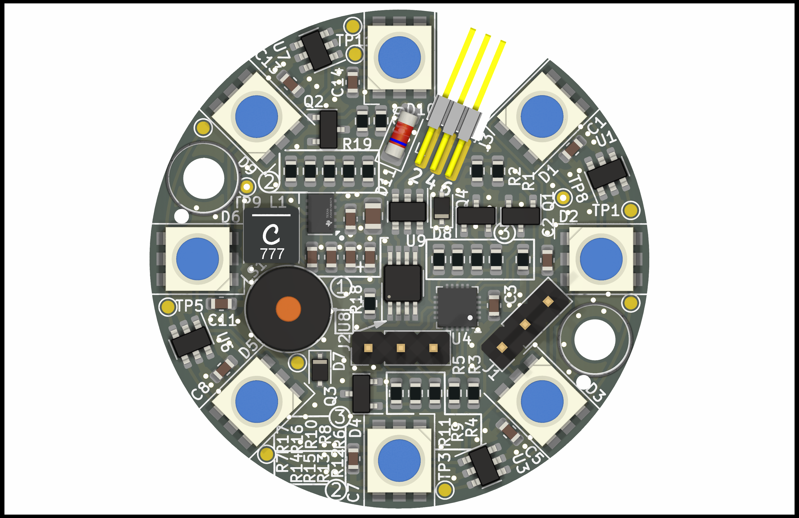

# ags Klingel



Fancy Klingel designed by Max Nowka.
Features:
- 24V VCC
- Piezo
- WS2813 RGB LEDs
- RS485 Support (bsp. für Modbus)
- "Touch"
- mit dem Gehäuse mehr oder weniger vandalismussicher

## How to CMake

```
mkdir build
cd build
cmake ..
```

oder es kann auch die CMake-GUI verwendet werden, wo auch die Konfigurationsoptionen komfortabel geändert werden können.

## Programmieren

Es gibt einen rudimentären Bootloader. Dieser kann mittels `make programbl` über UPDI (Standardport `/dev/ttyUSB0`) geflasht werden.
Weiterhin gibt es eine Software, die danach über RS485 mittels `make program` (Standardport `/dev/ttyUSB1`) geflasht werden kann.

## Lizenz

[GPLv3](COPYING)

## Weitere Credits

Bootloaderimplementierung teilweise von Optiboot ~~geklaut~~inspiriert.
